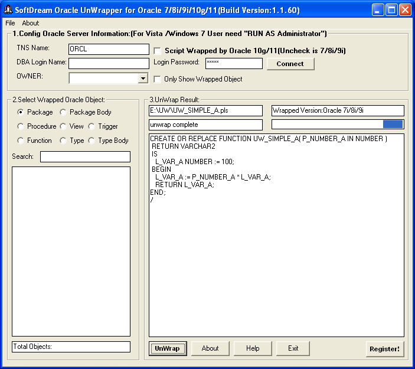
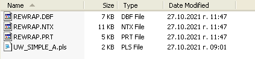
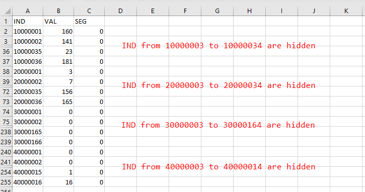
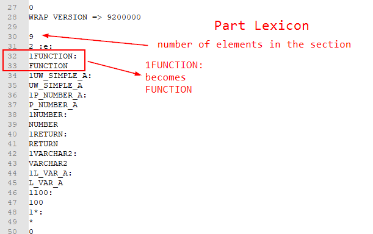
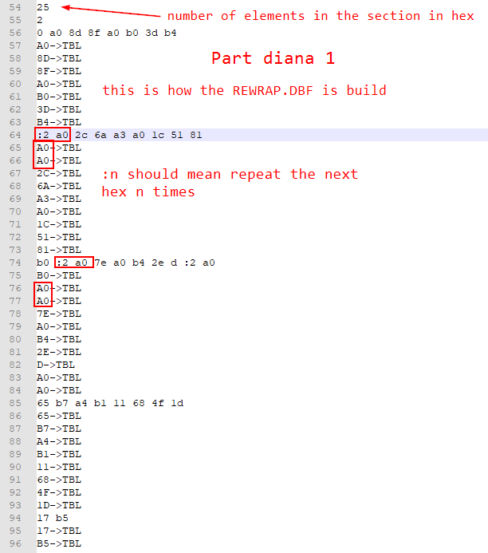
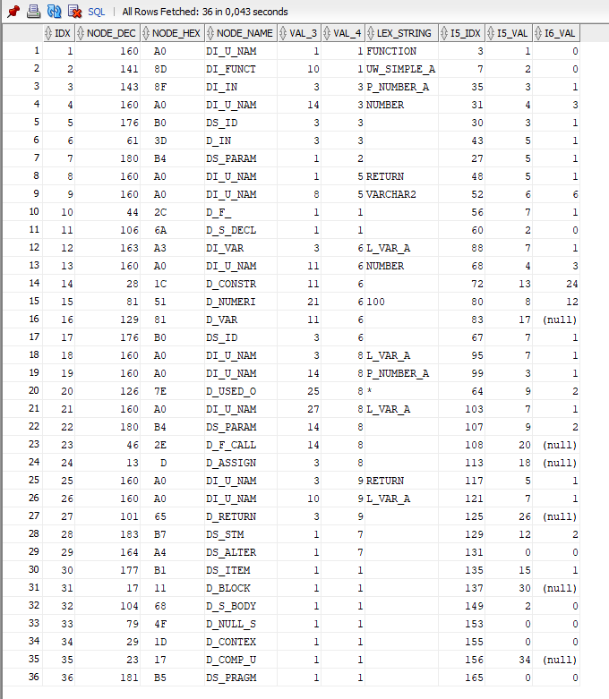
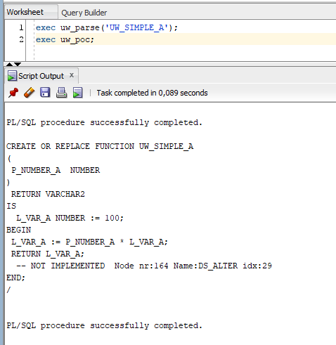
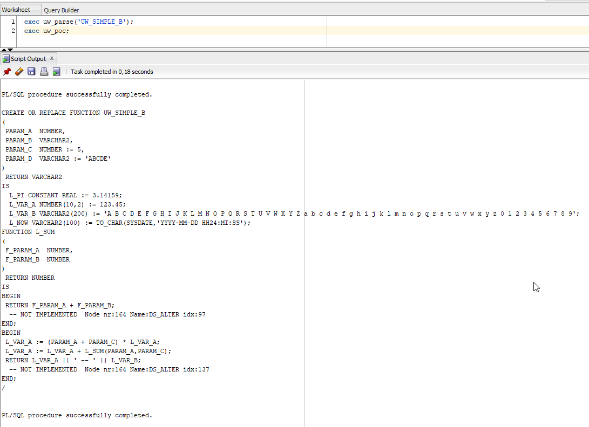

# 9i-unwrapper
The aim of this project is to explain the wrapped format and as second step to create an Unwrapper for pre 10g wrapped code.

To begin understanding the wrapped code the following resources, both from Pete Finnigan, were quite useful.

- [How to uwrap PL/SQL](http://www.petefinnigan.com/UnwrappingPLSQLBlackHat2006.pdf)
- [PL/SQL, AST, DIANA, Attributes and IDL](http://www.petefinnigan.com/weblog/archives/00001475.htm)

An abandoned shareware program [SoftDream Oracle UnWrapper](https://www.google.com/search?q=softdream+unwrapper) helped to get almost the complete picture. I was not interested in the unwrapped code as I already know it, but during the uwrap it writes down traces - see below.

To start we need a program with known source. Let's take this simple function
```
CREATE OR REPLACE FUNCTION UW_SIMPLE_A 
(
  p_number_a number
)
RETURN VARCHAR2 AS 
  L_VAR_A number := 100;
BEGIN
  L_VAR_A := p_number_a * L_VAR_A;
  RETURN L_VAR_A;
END;
```
which [wrapped](scripts/UW_SIMPLE_A.plb) looks like the following (with some comments `<- ...` added)
```
CREATE OR REPLACE FUNCTION UW_SIMPLE_A wrapped
0
abcd
....                                    <- 13 more abcd lines omited
abcd
3
8
9200000
1
4
0
9                                       <- Lexicon start
2 :e:
1FUNCTION:
1UW_SIMPLE_A:
1P_NUMBER_A:
1NUMBER:
1RETURN:
1VARCHAR2:
1L_VAR_A:
1100:
1*:                                     <- Lexicon end
0
0
0
25                                      <- Part 1 start
2
0 a0 8d 8f a0 b0 3d b4
:2 a0 2c 6a a3 a0 1c 51 81
b0 :2 a0 7e a0 b4 2e d :2 a0
65 b7 a4 b1 11 68 4f 1d
17 b5                                   <- Part 1 end
25                                      <- Part 2 start
2
0 3 7 23 1f 1e 2b 1b
30 34 38 3c 58 44 48 50
53 43 5f 63 40 67 6b 6c
71 75 79 7d 81 83 87 89
95 99 9b 9c a5                          <- Part 2 end
25                                      <- Part 3 start
2
0 1 a 3 e :2 3 :2 1 8
:2 1 3 :2 b 15 b :2 3 e 19
1b :2 e :2 3 a 3 :9 1                   <- Part 3 end
25                                      <- Part 4 start
4
0 :2 1 :4 3 2
:2 5 :2 1 :6 6 :7 8
:3 9 :2 7 :7 1
a7                                      <- Part 5 start
4
:3 0 1 :3 0 2
:a 0 20 1 :7 0
5 :2 0 3 4
:3 0 3 :7 0 5
4 :3 0 5 :3 0
6 :3 0 7 9
0 20 2 a
:2 0 9 :2 0 7
4 :3 0 d :7 0
8 :2 0 11 e
f 1e 0 7
:6 0 7 :3 0 3
:3 0 7 :3 0 9
14 16 :3 0 12
17 0 1c 5
:3 0 7 :3 0 1a
:2 0 1c c 1f
:3 0 1f f 1f
1e 1c 1d :6 0
20 :2 0 2 a
1f 23 :3 0 22
20 24 :8 0                              <- Part 5 end
11                                      <- Part 6 start
4
:3 0 1 3 1
6 1 c 2
13 15 2 18
1b 1 10                                 <- Part 6 end
1                                       <- Epilog
4
0
23
0
1
14
1
3
0 0 0 0 0 0 0 0
0 0 0 0 0 0 0 0
0 0 0 0
3 1 0
c 1 0
2 0 1
0
/
```
and back to source with SoftDream's UnWrapper



Still nothing spectacular. This was more or less expected. What I didn't expected were 3 files named REWRAP in the same directory.



They have to be written by the unwrapper and the name looks intriguing. We will ignore file [REWRAP.NTX](scripts/REWRAP.NTX). The same information is in [REWRAP.DBF](scripts/REWRAP.DBF). 

The content of REWRAP.DBF opened in Excel



The last file [REWRAP.PRT](scripts/REWRAP.PRT) reveals more information. Here some snippets from it.





Looking at REWRAP.PRT we see that sections Lexicon, Part 1, Part 2, Part 5 and Part 6 are processed with Part 3 and Part 4 ignored. Thanks to the information shared by Pate Finnigan we know that Part 1 are Diana Nodes, but how they relate to the other parts? Why are Part 3 and Part 4 ignored? Parts 1 to 4 have the same length. Why is Part 5 longer and Part 6 sorter? 

The answers to these questions are again in REWRAP.RPT. After processing Part 6 (ignoring the Epilog) there is an ANALYZE... section. So after analyzing the ANALYZE... section I've found the following relations.
- Part 1 - Diana Nodes
- Part 2 - Reference to the Nodes Attributes in Part 5
- Part 5 - The Node Attributes with references to either the Subnodes, the Lexicon or Part 6 depending of the Node Attribute property
- Part 6 - LIST values if the Node Property is AS_LIST


Next we will prove that these findings are correct. 

1. We will load the Lexicon and Parts 1 to 6 (including 3 and 4 to see what's in). 
2. Query the data with the above assumptions

This will be done in Oracle 18 XE logged to XEPDB1 as user SYS. We will read the wrapped source from the user_source table.
- Load and compile the wrapped function [UW_SIMPLE_A.plb](scripts/UW_SIMPLE_A.plb).
- Create the 3 temp tables below needed by the parser. 
- Load and compile the procedure [UW_PARSE.sql](scripts/uw_parse.sql).
```
create global TEMPORARY table uw_src ( idx number, src varchar2(80) );
CREATE GLOBAL TEMPORARY TABLE UW_LEX (IDX NUMBER, SRC VARCHAR2(4000 BYTE) ) ON COMMIT PRESERVE ROWS;
CREATE GLOBAL TEMPORARY TABLE UW_DIANA ( P NUMBER, IDX NUMBER, VAL NUMBER ) ON COMMIT PRESERVE ROWS;
```
parse the wrapped source to the tables
```
exec uw_parse ('UW_SIMPLE_A');
```

Query the tables
```
select  
    i1.idx, 
    i1.val node_dec, 
    to_char(i1.val,'XXX') node_hex, 
    pidl.ptattnnm(i1.val) node_name,
    i3.val val_3,
    i4.val val_4,
    case pidl.ptattcnt(i1.val) when 0 then ' ' else
        case pidl.ptattbty(i1.val,pidl.ptatttyp(i1.val,0)) when 2 then l.src 
        else ' ' end  
    end  lex_string
    , i5.idx i5_idx, i5.val i5_val
    , (select val from uw_diana where p = 6 and idx = i5.val) as i6_val
from
    uw_diana i1, 
    uw_diana i2,
    uw_diana i3,
    uw_diana i4,
    uw_diana i5,
    uw_lex l
where 
      i1.idx = i2.idx
  and i1.idx = i3.idx
  and i1.idx = i4.idx
  and i2.val = i5.idx
  and i5.val = l.idx(+)
  and i1.idx > 0
  and i1.p = 1
  and i2.p = 2
  and i3.p = 3
  and i4.p = 4
  and i5.p = 5
order by i1.idx;
``` 

The result from the query. 



Nice. With this output alone and with some knowledge of DIANA one should be able to reconstruct the source. We also clearly see the ignored Parts 3 and 4 are the source position as column and line respectively. They are only necessary, if you want to reconstruct and format the code identical to the original. Comments are removed, even if DIANA supports them.

[This proof of concept unwrapper](scripts/uw_poc.sql) is similar to Pete's [unwrap_r](http://www.petefinnigan.com/unwrap_r.sql), but reads our tables and is not asking DIANA and PIDL packages. It is able to recover simple functions. There is still a lot to do. Oracle 9.2 has 300 nodes in package DIANA. Here only 40 are "implemented". Constructs like LOOP, CURSOR, IF, EXCEPTION are missing, but reported during the unwrap, not silently ignored.

The PoC in action.

[UW_SIMPLE_A](scripts/UW_SIMPLE_A.plb)



[UW_SIMPLE_B](scripts/UW_SIMPLE_B.plb) -> [Soutce of UW_SIMPLE_B](scripts/UW_SIMPLE_B.sql)




## What's next? 
We just have to rename the script from Proof of Concept to UNWRAPPER and implement the remaining 260 DIANA Nodes.
